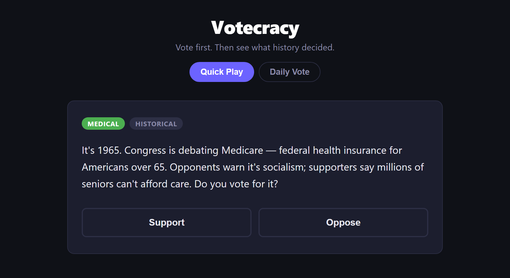

# Votecracy

**Vote on real policy questions from history — then find out what actually happened.**



You are shown a decision as the people of the time faced it: 1965, Congress is
debating Medicare; 1919, Prohibition is on the table; 1913, the income tax. You
get the arguments, not the answer. You vote. Only then does the game reveal how
the vote actually went, and what followed.

**Nothing about the outcome is visible before you vote** — not the historical
result, not what happened afterwards, not how other players are voting. That
rule is enforced on the server, not in the UI, and it has tests whose only job
is to keep it that way.

## Game modes

- **Quick play** — pull a random question, vote, see the reveal immediately.
- **Daily vote** — one question per UTC day, shared by everyone. Your vote is
  counted the moment you cast it; the community split unlocks when the day ends.

## Running it

Requires Docker and Node 18+.

```bash
docker compose up --build
```

Brings up the backend on `:8000`, Postgres on `:5432` and Redis on `:6379`. The
container runs `alembic upgrade head` before starting the app, so the schema is
migrated on boot. Then the frontend:

```bash
cd frontend && npm install && npm run dev
```

Open http://localhost:5173. Vite proxies `/api` to the backend. API docs are at
http://localhost:8000/docs.

To wipe all local state:

```bash
docker compose down -v
```

## Developing

Running the game needs only Docker and Node — the backend's Python lives in the
container. A local Python environment is for the things that run on the host:
the test suite and Alembic.

```bash
python -m venv .venv
```

```bash
source .venv/Scripts/activate      # Windows, Git Bash
.venv\Scripts\Activate.ps1          # Windows, PowerShell
source .venv/bin/activate           # macOS / Linux
```

```bash
pip install -r backend/requirements-dev.txt
```

`requirements.txt` is the runtime set that the container installs;
`requirements-dev.txt` adds it plus the test and lint tools.

## Tests

```bash
python -m pytest backend -q        # 120 backend tests, venv active

cd frontend && npm test            # 21 frontend tests
```

Both run on the host in seconds, with no containers. Redis and Postgres are
replaced by in-process stand-ins — including two tests that drive the vote path
under a thread pool and assert that N concurrent voters produce exactly N
counted votes.

Tests build the schema from the SQLAlchemy metadata rather than replaying the
migration chain, which is what keeps them container-free. The tradeoff is that
a model change without a matching migration passes here and fails on deploy;
`alembic check` against a live database is what catches it.

## Migrations

```bash
cd backend
alembic revision --autogenerate -m "what changed"
alembic upgrade head
alembic check                      # models vs live database: any drift?
```

Needs the venv active and Postgres up. The container applies migrations itself
before starting the app, so this is only for authoring them.

## Load testing

```bash
bash loadtest/run.sh
```

Resets state, drives k6 at the vote endpoint, then verifies the HTTP 200 count,
the Redis tally and the Postgres row count are all identical. Results are
written up in [`docs/metrics/`](docs/metrics/).

## How it works

Two systems that never touch each other on the request path: an offline content
pipeline that writes to a curated store, and a live game path that votes against
it. The live path never calls a language model.

A vote is deduplicated and tallied by a single Lua script so Redis performs both
atomically, then written to Postgres by a background task after the response is
sent — the cache keeps the count correct under concurrency, the database keeps
it after a restart.

[**docs/architecture.md**](docs/architecture.md) covers this properly: the
atomic vote path, what happens when Redis is unreachable versus merely empty,
the anonymous identity model and its limits, and the testing strategy.

## Stack

| | |
|---|---|
| Backend | Python 3.12, FastAPI |
| Frontend | React (Vite), PWA |
| Durable store | PostgreSQL |
| Cache / tally | Redis, AOF persistence |
| Local dev | Docker Compose |
| Load testing | k6 |

## Layout

```
backend/
  main.py         app wiring, quick-play endpoints
  daily.py        daily mode — vote path and degradation policy
  cache.py        Redis: the atomic dedupe + tally script
  db.py           Postgres: durable vote log
  identity.py     anonymous voter cookie
  content.py      curated content store
  data/           the questions
  tests/
frontend/src/     pages, components, api layer, tests
loadtest/         k6 script and the verification runner
docs/             architecture notes and load-test results
```

## License

[MIT](LICENSE)
